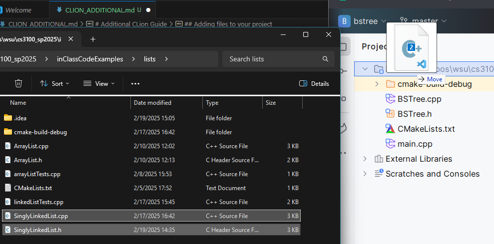
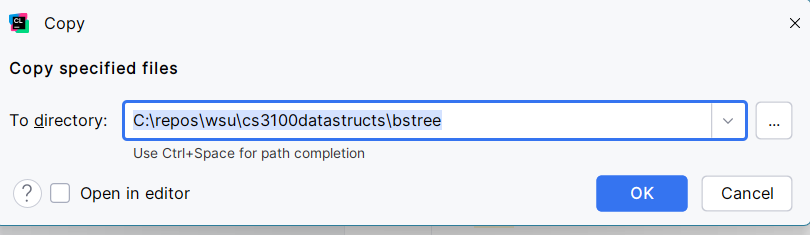
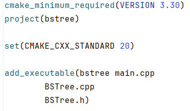
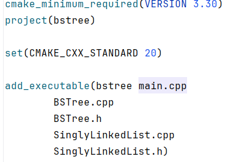
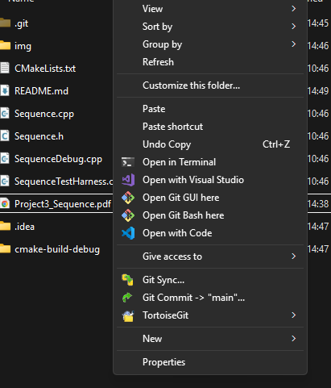
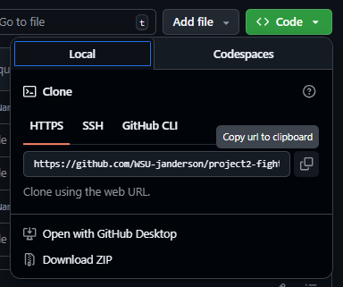
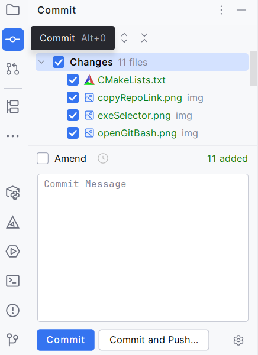
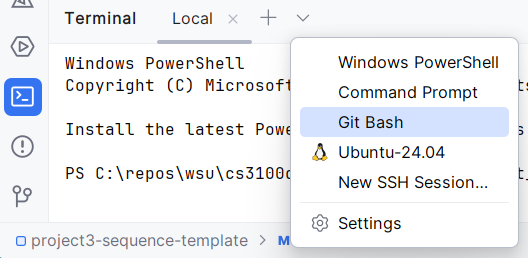

# Additional CLion Guide

## Adding files to your project
There are a few ways to add files into your project. I recommend just dragging them from your file explorer into the CLion Project pane.

If you drag them it will move the files, if you would rather copy the files into your project you can hold `CTRL` (you'll have to look up what it is for Mac) when you drag the files.  

After you drag the files, a window will pop up asking you to verify which directory you want to move or copy the files into. Make sure this is the directory with your other source files.

Once the files are moved/copied into your project folder, you now need to add them to the file `CMakeLists.txt`. This file is how CLion will know how to compile your program, including which files are required. 

Open `CMakeLists.txt` and find the statement that says `add_executable`. There should be a parameter there already for your project name, in my case is it `bstree`. There should also be the `main.cpp` file listed. If you already had any additional files, they will appear as parameters also. For my example, I already had two other files named `BSTree.cpp` and `BSTree.h`. 

 After those parameters, add the names of your files as parameters. Do not put commas between each filename. I usually put each file on a different line, but that isn't necessary. It also doesn't matter which order you put them, the only thing necessary is for the name of the executable (`bstree`) be the first parameter.

 

 
 ## Clone Repo
 
 After you accept the GitHub Classroom assignment, you need to clone the repository onto your computer. If you know how to clone a repository, you can skip this step. If on Windows, I recommend browsing in the File Explorer to the directory you wish to clone the repository into. If you right-click, you should see an option to `Open Git Bash here`.
 
 
 
 That will open a terminal with the working directory the same as the one you were in. Go to your repoository in a web browser, and click the `<> Code` drop-down. 
 
 
 
 You will see the URL for your repository, and if you click on the squares to the right of that, it will copy the link to your clipboard. Back in Git Bash, type `git clone `, then press `Shift-Insert` to paste. You can also right-click to paste. Press enter, and you may be asked to log in to GitHub. If successful, you now have the repository cloned.
 
  ## Commit and Push
 
 You should regularly commit your work, and I recommend pushing often so your work is backed up. In CLion, you should at least be able to commit. For some reason, most students cannot push their commits directly from CLion. To commit, you will click on the Commit pane to the left of the project pane. Check the files you wish to commit, then type a message and click `Commit`.
 
 
 
 To push, at the bottom left, click on the Terminal pane. From the drop-down, select `Git Bash` to open a new bash shell. Type `git push`, and your code should now appear on the remote branch.
 
 

