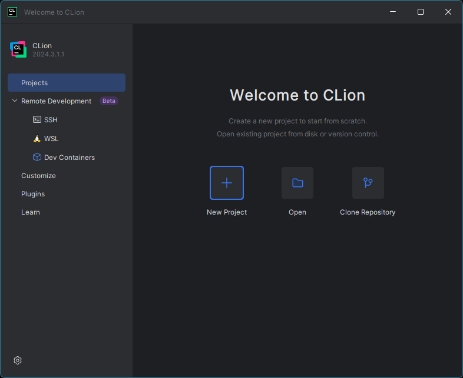
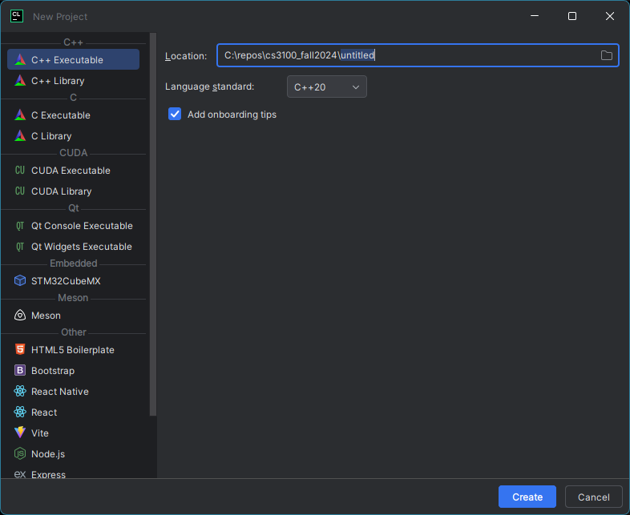
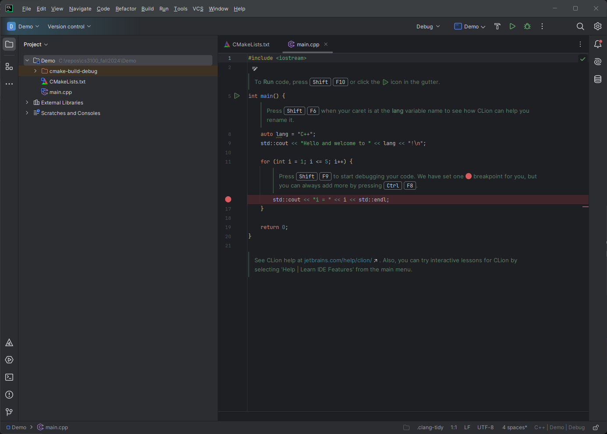
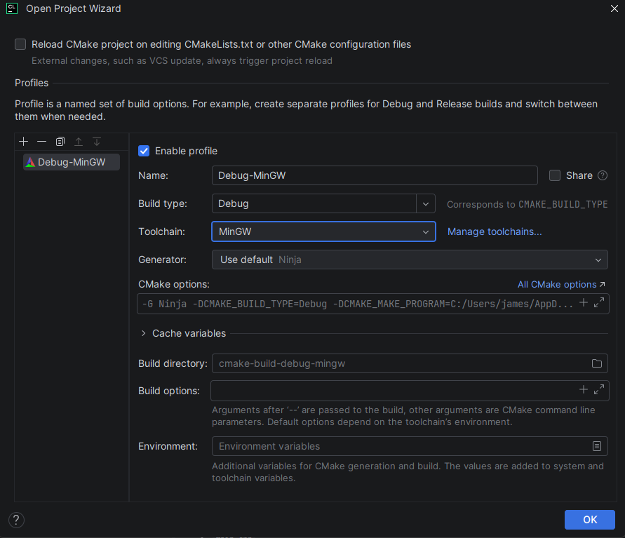

# CLion Tutorial

CLion is a C++ IDE from JetBrains. If you have used other JetBrains IDEs such as PyCharm (for Python) or IntelliJ (for Java/Kotlin), or even Android Studio, CLion will be very familiar.

CLion is cross-platform and will run on Windows, Mac, and Linux. Also, you can obtain an education license which lets you use CLion for free. You do need to sign up for a JetBrains account and get verified with your WSU email. The license lasts for a year, and as long as you are a student you can renew it.

## Installing CLion

To install, go to https://www.jetbrains.com/clion/. Next to the `Download` button, there is a link for [students and teachers](https://www.jetbrains.com/community/education/#students) Scroll down a bit and there is a button to `Apply Now`

## Create Your First C++ Project

After you have CLion installed and running, you will see the welcome screen.



From the welcome screen, there are three ways to create or open a CLion project. 

### New Project

If you have not been given any starting files, you will need to create a new project from scratch.

Click `New Project` and you will see the next screen.



 Make sure you have `C++ Executable` selected on the left. Put where you want the project saved in the `Location` text box. The last directory will also be the name of the project, so I'd name it something like `Project1`, or whatever the name of the assignment is. 
 
 For language standard, I wouldn't go higher than C++20. If for some reason C++20 isn't an option, select whatever the next highest version is, probably C++17. 
 
 Lastly there is a checkbox for `Add onboarding tips`. I would unselect it, if you keep it checked it will generate comments in the code that help you get started with CLion, so if you want them you can keep it and just delete the comments later. If you decide to check the box and click `Create`, your project will open with a "Hello, world" program.

 

 For this screenshot, I selected `Add onboarding tips`. If you deselected that, yours will look different.

## Open

Existing C++ projects will typically have `.h` and `.cpp` files, as well as a file named `CMakeLists.txt`. When you open a project, you will open the directory that contains `CMakeLists.txt`. Not doing so can cause CLion not to recognize and correctly load your code. 

If you are opening a C++ project directory for the first time, an `Open Project Wizard` window should appear. It will look similar to:



If you are using Windows, CLion will have installed everything necessary to build C++ projects. 

If you are using macOS, you may need to install a C++ compiler. This tutorial will instruct you how to check and install if necessary:  
[Tutorial: Configure CLion on macOS](https://www.jetbrains.com/help/clion/quick-tutorial-on-configuring-clion-on-macos.html)

If you are using Linux, you may need to install a C++ compiler. You can do so with the following commands:
```bash
# Installing GCC:
sudo apt update
sudo apt install gcc
sudo apt install build-essential
```

CLion can also work with projects on WSL. I personally prefer this option instead of working with Windows, however it can require more setup. A walkthrough of how to set up CLion with WSL can be found at:  
[https://www.jetbrains.com/help/clion/how-to-use-wsl-development-environment-in-product.html](https://www.jetbrains.com/help/clion/how-to-use-wsl-development-environment-in-product.html)

## Clone Repository

The third way to create a new CLion project from existing source code is to clone a repository. After cloning the repository, you should see the `Open Project Wizard` that would appear when you open a local directory.

## Running and Debugging

*TODO*

## Adding Source Files

There are a few ways to add files into your project. I recommend just dragging them from your file explorer into the CLion Project pane.


If you drag them it will move the files, if you would rather copy the files into your project you can hold `CTRL` (you'll have to look up what it is for Mac) when you drag the files.

After you drag the files, a window will pop up asking you to verify which directory you want to move or copy the files into. Make sure this is the directory with your other source files.


### Add source files to CMakeLists.txt

Once the files are moved/copied into your project folder, you now need to add them to the file `CMakeLists.txt`. This file is how CLion will know how to compile your program, including which files are required.

Open `CMakeLists.txt` and find the statement that says `add_executable`. There should be a parameter there already for your project name, in my case is it `bstree`. There should also be the `main.cpp` file listed. If you already had any additional files, they will appear as parameters also. For my example, I already had two other files named `BSTree.cpp` and `BSTree.h`.


 After those parameters, add the names of your files as parameters. Do not put commas between each filename. I usually put each file on a different line, but that isn't necessary. It also doesn't matter which order you put them, the only thing necessary is for the name of the executable (`bstree`) be the first parameter.

 

 ## Git in Clion
